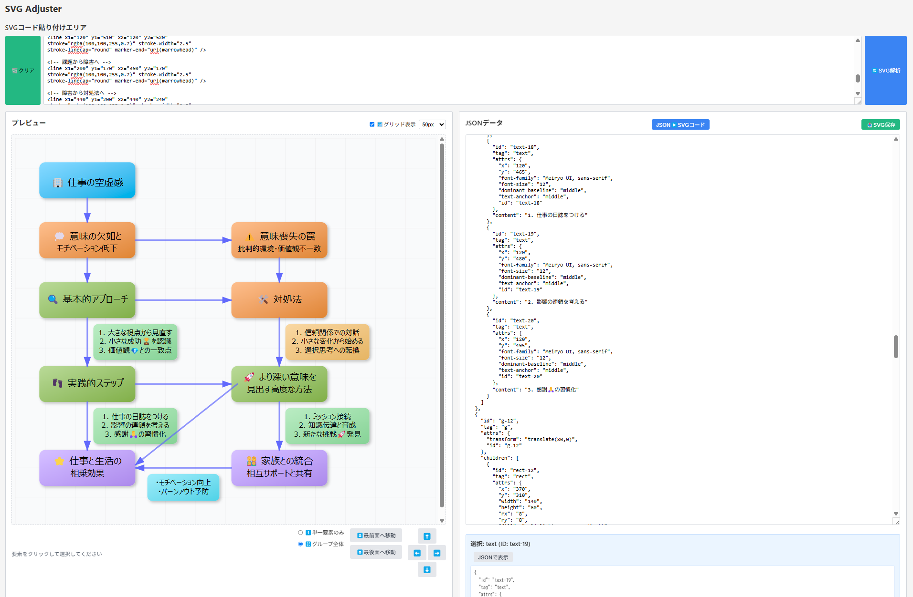

# SVG Adjuster - 視覚的に直感操作できるSVG位置・レイヤー調整ツール

## 背景

### これまでの課題と問題点 🔍

SVGファイルは拡張性とクオリティの高さから様々な場面で利用されていますが、作成後の微調整には次のような課題がありました：

- 要素の位置調整が数値入力による試行錯誤で時間がかかる
- 重なり順序（前面/背面）の調整がコードを直接編集する必要がある
- グループ要素と個別要素の扱いが複雑で直感的でない
- SVGコードとビジュアル表現の対応関係が分かりにくい

### 本ツールで得られる価値・解決できる問題 💡

SVG Adjusterは上記の課題を解決し、以下の価値を提供します：

- SVGコードを視覚的にプレビューしながら調整できる
- 要素をクリックして選択し、ボタン操作で移動できる
- 要素の重なり順序を簡単に変更できる
- グループ単位または個別要素単位での操作を切り替え可能
- JSONフォーマットでの編集と即時プレビュー機能

### 導入によるメリット ✅

- SVG編集の効率が大幅に向上
- コーディングスキルが低いユーザーでも視覚的に調整可能
- SVG構造の理解がビジュアルフィードバックで促進される
- グリッド表示機能で正確な位置合わせが可能
- SVGコードとJSONデータの相互変換による柔軟な編集



スクリーンショット

## 機能概要

### 主要機能のハイレベル説明 🚀

1. **SVGコード解析・表示機能**：
   SVGコードを解析してJSONデータに変換し、ビジュアルプレビューを表示

2. **要素選択・情報表示機能**：
   プレビュー上の要素をクリックして選択し、詳細情報を表示

3. **位置調整機能**：
   選択した要素を方向ボタンで移動、単一要素またはグループ全体での操作が可能

4. **重なり順序調整機能**：
   選択した要素やグループを最前面/最後面に移動

5. **グリッド表示機能**：
   調整しやすいようグリッドを表示、サイズも変更可能

6. **JSON編集機能**：
   SVG構造をJSON形式で編集し、リアルタイムでプレビュー反映

7. **SVG保存機能**：
   調整後のSVGをファイルとして保存

### 利用シナリオ例 🎯

**シナリオ1: デザイナーの微調整作業**
1. デザインツールからエクスポートしたSVGを微調整
2. 位置ずれした要素をグリッド表示を活用して正確に配置
3. レイヤー順序を調整して正しい重なり表示を実現
4. 調整済みSVGを保存して他のプロジェクトで使用

**シナリオ2: 開発者の実装前調整**
1. 外部から入手したSVGアイコンセットの配置調整
2. グループ操作で関連要素をまとめて移動
3. JSONデータを直接編集して複雑な調整を実施
4. 最終調整済みのSVGコードをアプリケーションに実装

**シナリオ3: SVG学習者の構造理解**
1. サンプルSVGを読み込んで構造を確認
2. 要素をクリックして各パーツの役割を理解
3. JSONデータと実際の表示の関係性を学習
4. 試行錯誤で調整を行いながらSVG構造への理解を深める

## 機能詳細

### 各機能の詳細説明 📋

#### 1. SVGコード解析・表示機能
- SVGコードをテキストエリアに入力またはサンプル読み込み
- 「SVG解析」ボタンでコードをパース
- パース結果をJSONに変換し、ビジュアルプレビューを表示
- エラー発生時は詳細なエラーメッセージを表示

#### 2. 要素選択・情報表示機能
- プレビュー上で任意の要素をクリック
- 選択要素のタグ名やID、属性情報を表示
- 「JSONで表示」ボタンで対応するJSON部分を検索・ハイライト

#### 3. 位置調整機能
- 矢印ボタン（⬆️⬇️⬅️➡️）で選択要素を移動
- 移動モード切替（単一要素/グループ全体）
- 単一要素モード: 選択した要素のみを移動
- グループ全体モード: 選択要素を含むグループ全体を移動

#### 4. 重なり順序調整機能
- 「最前面へ移動」: 選択要素を最前面に表示
- 「最後面へ移動」: 選択要素を最背面に表示
- 単一要素またはグループ全体での順序操作

#### 5. グリッド表示機能
- グリッド表示ON/OFF切替
- グリッドサイズ変更（25px/50px/100px）
- 半透明のガイドラインで位置合わせをサポート

#### 6. JSON編集機能
- SVG構造をJSON形式で表示・編集
- リアルタイムで編集内容をプレビューに反映
- 複雑な構造も階層的に把握・編集可能

#### 7. SVG保存機能
- 調整後のSVGを「SVG保存」ボタンでファイル保存
- 編集用グリッドを除外した状態で保存
- 「JSON▶️SVGコード」ボタンでコードをテキストエリアに戻し、コピー可能

### 入出力データ形式 💾

**入力データ**:
- SVGコード（テキスト形式）
  ```html
  <svg viewBox="0 0 100 100">
    <rect x="10" y="10" width="80" height="80" fill="darkblue" id="rect1" />
    <circle cx="50" cy="50" r="25" fill="red" id="circle1" />
  </svg>
  ```

**内部データ**:
- JSON形式のSVG構造データ
  ```json
  [
    {
      "id": "rect1",
      "tag": "rect",
      "attrs": {
        "x": "10",
        "y": "10",
        "width": "80",
        "height": "80",
        "fill": "darkblue"
      }
    },
    {
      "id": "circle1",
      "tag": "circle",
      "attrs": {
        "cx": "50",
        "cy": "50",
        "r": "25",
        "fill": "red"
      }
    }
  ]
  ```

**出力データ**:
- 調整済みSVGコード（テキスト形式またはファイル）

### 設定オプションと推奨設定 ⚙️

**調整設定**:
- **移動距離**: 固定値5.5ピクセル（標準設定）
- **グリッドサイズ**: 25px/50px/100px（デフォルト: 50px）
- **移動モード**: 単一要素/グループ全体（デフォルト: 単一要素）

**推奨設定**:
- 細かい調整をする場合は25pxグリッド
- 全体的なレイアウト調整は50pxまたは100pxグリッド
- 関連する要素をまとめて移動する場合はグループ全体モード

## 使用手順

### インストール方法 📥

SVG Adjusterはブラウザベースのアプリケーションで、特別なインストールは不要です。

1. プロジェクトファイル（HTML、JS、CSSファイル）をダウンロード
2. ファイルを同じディレクトリに配置
3. index.htmlをブラウザで開く

### 基本的な操作フロー 🔄

1. **SVGコードの入力**
   - テキストエリアに直接SVGコードを貼り付け
   - または「基本図形」「パス＆テキスト」などのサンプルボタンをクリック

2. **SVGの解析**
   - 「🔄SVG解析」ボタンをクリック
   - 成功するとプレビューとJSONエディタが表示される

3. **要素の選択**
   - プレビュー内の調整したい要素をクリック
   - 選択された要素の情報が表示される

4. **要素の調整**
   - 方向ボタンで位置を調整
   - 「⏫最前面へ移動」「⏬最後面へ移動」で重なり順序を調整
   - 単一要素/グループ全体の切り替えで操作範囲を変更

5. **結果の出力**
   - 「JSON▶️SVGコード」でテキストエリアにコードを反映
   - 「📥SVG保存」ボタンでファイルとして保存

### 実行環境要件 🖥️

- **対応ブラウザ**: 
  - Google Chrome（最新版推奨）
  - Mozilla Firefox（最新版推奨）
  - Microsoft Edge（最新版推奨）
  - Safari（最新版推奨）

- **最小表示推奨解像度**: 1280 x 800以上
- **その他の要件**: JavaScript有効設定

### トラブルシューティング 🔧

**問題: SVGの解析に失敗する**
- **解決策**: 
  - SVGの文法が正しいか確認
  - 不要なXML名前空間宣言を削除
  - 特殊文字やエンコーディングの問題を確認

**問題: 要素を選択できない**
- **解決策**:
  - 複雑な要素の場合、外側の要素から順に選択を試みる
  - グループ内の要素は直接選択できない場合あり、グループを先に選択

**問題: 移動操作が反映されない**
- **解決策**:
  - 要素タイプによって操作方法が異なる場合あり
  - JSON編集モードで直接座標を変更
  - 単一/グループモードの設定を確認

**問題: プレビューが表示されない**
- **解決策**:
  - ブラウザの更新
  - キャッシュのクリア
  - JavaScript実行環境の確認

## 制限事項

### 既知の制約 ⚠️

- **サポート要素の制限**: 
  現在サポートしている要素は以下のみ
  - 基本図形: rect, circle, ellipse, line, polyline, polygon
  - パス要素: path
  - テキスト要素: text
  - グループ要素: g
  - マーカー要素: marker
  - その他: defs内の各種定義要素（linearGradient, radialGradientなど）

- **移動距離精度**:
  - 移動はデフォルトで5.5ピクセル単位で、より細かい調整はJSON直接編集が必要

- **複雑なSVG制限**:
  - 高度なアニメーション要素やスクリプト要素は正しく解析・表示できない場合あり
  - 大量の要素を含むSVGはパフォーマンスが低下する可能性あり

### 非対応機能 🚫

- アニメーション要素（animate, animateTransform）の編集
- SVGフィルターの詳細な編集
- スクリプト要素（script）のサポート
- 複雑な座標変換（transform）の視覚的編集
- 画像要素（image）のプレビューと編集
- 複数SVGファイルの同時編集
- 高度な描画機能やベジェ曲線の制御点編集

### パフォーマンス上の考慮点 ⚡

- **大規模SVGのパフォーマンス**:
  - 1000要素以上の複雑なSVGはレスポンスが遅くなる可能性
  - 特に大量のパスを含むSVGはメモリ使用量が増加

- **リアルタイム編集の制限**:
  - JSON編集中の連続更新は負荷が高くなる場合あり
  - 大きな変更を行う場合は一時的にJSON編集後に一括適用が効率的

- **ブラウザ依存の問題**:
  - ブラウザによって一部の機能やパフォーマンスに差異がある可能性
  - 最新のChrome/Firefoxでの使用を推奨

## ライセンス
個人の範囲でご使用ください。
```
Copyright (c) 2025 Daily Growth
https://yourworklifedesign.blogspot.com/
All rights reserved.
```